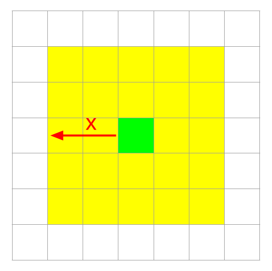
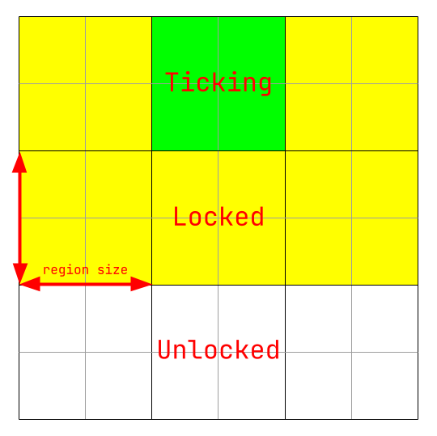

# How it works

## Fundamental principle

Chunks are split across multiple threads to increase the speed of each tick.

However, if two threads are trying to access the same chunk at the same time,
everything breaks.

Thus, we need to lock the chunk when we tick it, along with any nearby chunks
we might need to access (eg redstone going into the neighbouring chunk).

## Optimising with regions

A minecraft server can have thousands of chunks loaded at once, and locking each
one individually when ticking them 20 times per second would be very slow.

To combat this, we split the chunks into regions, and lock the region instead of
each individual chunk.

If we set the size of the region to be the same as the locking radius, we will
only have to lock the directly neighbouring regions in a 3x3 grid around the
region of chunks that we wish to tick, which makes the locking process much
faster.

