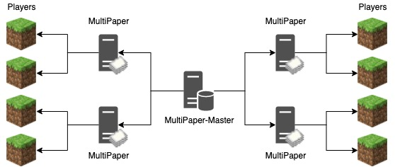

# MultiPaper

[](https://discord.gg/dN3WCZkSRV)

**MultiPaper is in public beta.** Most features work for most players most of
the time, however things can occasionally break.

1.18 [Paper](https://github.com/PaperMC/Paper) fork that enables a server admin
to scale a single world across multiple servers. Multiple MultiPaper servers run
the same world and use a MultiPaper-Master to coordinate with eachother and
store server data. While the MultiPaper-Master is usually run as a standalone
server, it can also be run as a BungeeCord plugin, which has some benefits
including being able to send players to the least busiest server when they
join.

MultiPaper 2.0:

- Works like a CDN
    - Each server caches chunks that are needed by the players it's serving
    - The servers keep each others' caches in sync with eachother
    - The servers work together to ensure every chunk gets ticked
    - Does not require BungeeCord, just some node balancing method to evenly
      distribute players across the servers

- MultiPaper-Master
    - Stores the world files and data
    - Coordinates the servers
        - Decides who gets to tick the chunk (first in first served basis)
    - Runs as a standalone process
        - For your convenience, it can also run as a BungeeCord plugin



How chunk syncing works:

- When a server reads a chunk, it asks the Master to load the chunk from the
  region file. If another server has ownership of the chunk, the Master will
  notify the server to request the chunk from that server instead, so that it
  gets the most up-to-date copy.
- When the server wants to tick an unowned chunk, it won't, but will instead
  send a request to the Master to take ownership of it. If ownership is
  granted, the chunk will be ticked on next tick. If ownership is denied since
  another server owns it, the server will keep the chunk in sync with that
  server.
- A chunk may be loaded on a server but have no owner if it's outside the
  simulation distance. This is since the chunk won't be ticked by any server.
- When a server has a chunk loaded into memory, it will subscribe to any
  changes made within that chunk. This means if any server changes a block
  inside the chunk, it will be updated on all servers subscribed to that chunk.

## The use case

For servers that wish to maintain all vanilla mechanics while scaling up,
MultiPaper is for you. Usually when a Minecraft server chooses to scale their
player count up, they have to sacrifice various mechanics such as render
distance, mob spawning, and redstone.

With MultiPaper, there is no need to ruin the vanilla experience. All you need
are new servers when you wish to scale. Instead of having 1 server handling
100 players, you can have 10 servers handling 10 players each. This allows you
to keep expensive vanilla mechanics like a large render distance, mob farms,
and massive redstone contraptions.

### MultiPaper Pro

For those who wish to go above the typical 250 player limit imposed by
existing server technology, and/or minimise their hardware costs,
MultiPaper-Pro is for you. Extra time and money has been spent into
MultiPaper-Pro to introduce various optimisations into
both the MultiPaper engine and Minecraft itself, allowing your server to run
more efficiently and hold insane numbers of players.

Testing of MultiPaper-Pro against other popular server software gave us the
following results:

| Implementation | Tick time (lower is better) |
| --- | ----------- |
| Paper | 90ms |
| Purpur | 75ms |
| MultiPaper-Pro | 65ms |

** Note: your results may vary depending on server configuration and player
activity.

MultiPaper-Pro will be available for 50 cents per player slot per month.
Contact puregero@gmail.com if you're interested. A $50/hour service is also
available for converting plugins to become compatible with MultiPaper.

## Commands
MultiPaper includes a few commands mainly for debug purposes:

`/servers`  
List all servers running on this MultiPaper cluster. Includes performance
indicators such as TPS, tick duration, and player count.

`/slist`  
List all online players and what server they're on.

`/mpdebug`  
Toggle a debug visualisation showing chunks that your server is ticking (aqua)
and chunks being ticked by another server (red). The server ticking the chunk
you are standing in is displayed above the action bar.

`/mpmap`  
Show a map of nearby chunks and which server owns them. Up represents north. If
your server owns the chunk, the chunk is shown as aqua. If another servers owns
the chunk, it's shown as red. If the chunk is in memory but not within
simulation range on your server, it's shown as white. Chunks not loaded on your
server as shown as grey.

## Setting up MultiPaper
  * Place your worlds inside the directory being used for MultiPaper-Master
  * Start the MultiPaper-Master by either:
    * Standalone: `java -jar multipaper-master.jar <port> [optionalProxyPort]`
    * BungeeCord plugin: Set the port in `plugins/MultiPaperProxy/config.yml`
  * In each MultiPaper server:
    * Run the server once the generate the config file `multipaper.yml`
    * Put the name of the server used in BungeeCord's config.yml in `bungeecordName`
      * If you're not using BungeeCord, just make it some unique identifier
      * eg. `survival1`
    * Put the address and port of the MultiPaper-Master in `multipaperMasterAddress`
      * eg. `localhost:35353`
    * Enter the port for your local peer-to-peer server in `externalServerPort`
      * Leave this as `0` for it to automatically choose a port for you
      * This value can be different for each server
      * Other servers are let known of your port via MultiPaper-Master

## The built-in proxy
MultiPaper provides a proxy (like Bungeecord or Velocity) that can be used to
hide the multipaper servers behind a single address. The proxy automatically
selects the multipaper server with the lowest load and forwards the player
to it. The proxy provides no extra features and is designed to be as fast and
light-weight as possible. When using the proxy, you will need to set
`bungeecord` to `true` in the multipapers' `spigot.yml`.

This proxy is only available when running a standalone MultiPaper-Master
installation and can be started by specifying a port for it to listen on:

`java -jar multipaper-master.jar <port> [proxy port]`

For example, to run the MultiPaper-Master on port 35353 and the proxy on port
25565, you'd run:

`java -jar multipaper-master.jar 35353 25565`
  
## Using MultiPaper with plugins
For a plugin to work with MultiPaper, it needs to support multiple servers. A
good indication of this, but not a guarantee, is if a plugin uses a MySQL
database.

### Developing a plugin for MultiPaper
To make a plugin compatible with MultiPaper, no data must be stored on the
server itself and must instead be stored on an external server such as a MySQL
database.

Some other things to look out for:

  * Caches can prevent the plugin from getting the most up-to-date data.
  * `PlayerJoinEvent` and `PlayerQuitEvent` will only be called on one server,
    however other events for the player could be called on any server.
  * `Bukkit.broadcastMessage` will send the message to all players on all
    MultiPaper servers.
  * `Bukkit.getOnlinePlayers` will return the players on all MultiPaper
    servers. You can use `Player.isLocalPlayer()` to determine if the player
    is on your server or not.

### Using the MultiPaper API as a dependency

[](https://clojars.org/com.github.puregero/multipaper-api)

If you want your plugin to still support regular Spigot and Paper servers, we
recommend using [MultiLib](https://github.com/PureGero/MultiLib) instead.

Add the following into your build.gradle:

```
repositories {
  maven {
    url "https://repo.clojars.org/"
  }
}

dependencies {
  compile "com.github.puregero:multipaper-api:1.18-R0.1-SNAPSHOT"
}
```

Or in your pom.xml:

```
<repositories>
    <repository>
        <id>clojars</id>
        <url>https://repo.clojars.org/</url>
    </repository>
</repositories>
<dependencies>
    <dependency>
        <groupId>com.github.puregero</groupId>
        <artifactId>multipaper-api</artifactId>
        <version>1.18-R0.1-SNAPSHOT</version>
    </dependency>
</dependencies>
```

## Building
Requirements:
- You need `git` installed, with a configured user name and email. 
   On windows you need to run from git bash.
- You need `jdk` 17+ installed to compile (and `jre` 17+ to run)

Build instructions:
1. Patch paper with: `./gradlew applyPatches`
2. Build the multipaper jar with: `./gradlew createReobfPaperclipJar`
3. Get the multipaper jar from `build/libs`
4. Get the multipaper-master jar from `MultiPaper-Master/build/libs`

## Publishing to maven local
Publish to your local maven repository with: `./gradlew publishToMavenLocal`

### Acknowledgements

MultiPaper includes optimisations from both
[Airplane](https://github.com/TECHNOVE/Airplane) and
[Pufferfish](https://github.com/pufferfish-gg/Pufferfish).

MultiPaper uses PaperMC's paperweight framework found
[here](https://github.com/PaperMC/paperweight).

